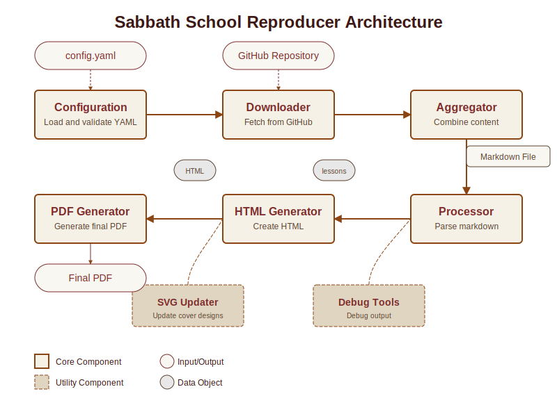

Overview
========

What is Sabbath School Reproducer?
----------------------------------

The Sabbath School Reproducer is a tool that downloads, formats, and reproduces Sabbath School lessons from historical archives for modern use. It enables users to adapt historical lessons with updated dates and formatting for current study.

Key Features
-----------

* **YAML-based configuration** for easy customization
* **Automatic downloading** of lesson content from GitHub
* **Reproduction mode** for adapting historical lessons to current dates
* **Professionally formatted PDF generation** with customizable styling
* **Support for custom cover designs** with SVG templates

Architecture
-----------

The system consists of several components that work together:

1. **Configuration** - Loads and validates settings from a YAML file
2. **Downloader** - Fetches lesson content from the GitHub repository
3. **Aggregator** - Combines downloaded content into a single markdown file
4. **Processor** - Converts markdown to structured content data
5. **HTML Generator** - Creates HTML from structured content
6. **PDF Generator** - Converts HTML to a formatted PDF with proper pagination

Workflow
--------

A typical workflow involves:

1. Creating a configuration file with target year/quarter and source year/quarter
2. Running the tool to download and process the content
3. Reviewing the generated PDF for any adjustments needed
4. Distributing the final PDF for use in Sabbath School classes

Getting Started
--------------

See the :doc:`installation` and :doc:`usage` pages for detailed instructions on installing and using the tool.